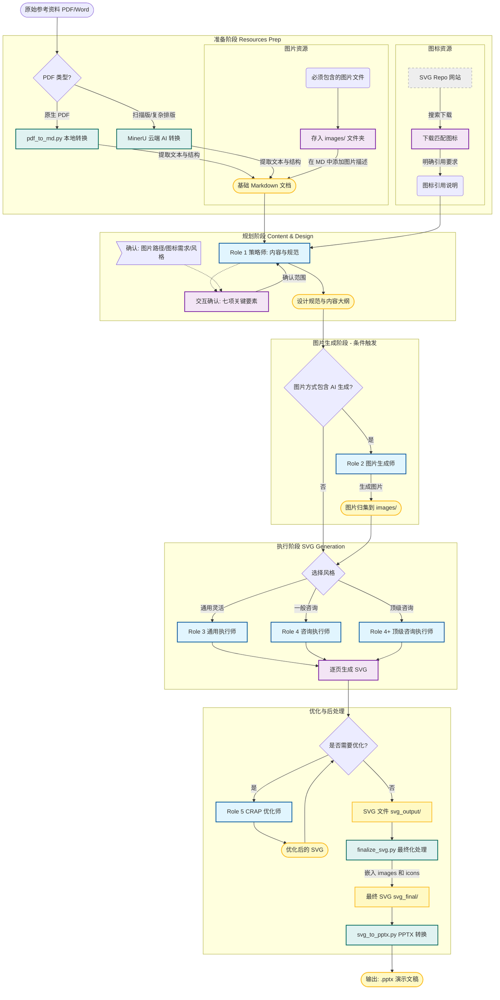

# PPT Master - AI 驱动的多格式 SVG 内容生成系统

[](./VERSION)
[](https://opensource.org/licenses/MIT)
[](https://github.com/hugohe3/ppt-master/stargazers)

[English](./README_EN.md) | 中文

一个基于 AI 的智能视觉内容生成系统，通过多角色协作，将源文档转化为高质量的 SVG 内容，**支持演示文稿、社交媒体、营销海报等多种格式**。

> 🎴 **在线示例**：[GitHub Pages 在线预览](https://hugohe3.github.io/ppt-master/) - 查看实际生成效果

> 🎬 **快速示例**：[YouTube](https://www.youtube.com/watch?v=jM2fHmvMwx0) | [Bilibili](https://www.bilibili.com/video/BV1iUmQBtEGH/) - 观看视频演示

---

## 🚀 快速使用指南

### 推荐工具

| 工具                                                | 推荐度 | 说明                                                                          |
| --------------------------------------------------- | :----: | ----------------------------------------------------------------------------- |
| **[Antigravity](https://antigravity.dev/)**         | ⭐⭐⭐ | **强烈推荐**！免费使用 Opus 4.5，集成 Banana 生图功能，可直接在仓库里生成配图 |
| [Cursor](https://cursor.sh/)                        |  ⭐⭐  | 主流 AI 编辑器，支持多种模型                                                  |
| [VS Code + Copilot](https://code.visualstudio.com/) |  ⭐⭐  | 微软官方方案                                                                  |
| [Claude Code](https://claude.ai/)                   |  ⭐⭐  | Anthropic 官方 CLI 工具                                                       |

> 💡 **AI 生成图片建议**：如需 AI 生成配图，建议在 [Gemini](https://gemini.google.com/) 中生成后选择 **Download full size** 下载，分辨率比 Antigravity 直接生成的更高。Gemini 生成的图片右下角会有星星水印，可使用 [gemini-watermark-remover](https://github.com/journey-ad/gemini-watermark-remover) 或本项目的 `tools/gemini_watermark_remover.py` 去除。

### 三步开始

```
1️⃣ 克隆仓库
   打开编辑器 → Clone Repository → 输入本仓库地址
   git clone https://github.com/hugohe3/ppt-master.git

2️⃣ 打开聊天窗口
   在编辑器中打开 AI 聊天面板（Antigravity/Cursor/Copilot Chat）

3️⃣ 开始对话
   直接告诉 AI 你想创建什么内容，AI 会自动按照仓库中的角色定义工作
```

### 使用示例

```
用户：我有一份关于 Q3 季度业绩的报告，需要制作成 PPT

AI（Strategist 角色）：好的，在开始之前我需要完成八项确认...
   1. 画布格式：[建议] PPT 16:9
   2. 页数范围：[建议] 8-10 页
   ...
```

💡 **模型推荐**：Opus 4.5 效果最佳，Antigravity 目前可免费使用

---

## 🎴 精选示例

> 📁 **示例库**: [`examples/`](./examples/) · **15 个项目** · **229 页 SVG**

### 示例项目总览

| 类别            | 项目                                                                           | 页数 | 特色                              |
| --------------- | ------------------------------------------------------------------------------ | :--: | --------------------------------- |
| 🏢 **咨询风格** | [心理治疗中的依恋](./examples/ppt169_顶级咨询风_心理治疗中的依恋/)             |  32  | 顶级咨询风格，最大规模示例        |
|                 | [构建有效AI代理](./examples/ppt169_顶级咨询风_构建有效AI代理_Anthropic/)       |  15  | Anthropic 工程博客，AI Agent 架构 |
|                 | [重庆市区域报告](./examples/ppt169_顶级咨询风_重庆市区域报告_ppt169_20251213/) |  20  | 区域财政分析，企业预警通数据 🆕   |
|                 | [甘孜州经济财政分析](./examples/ppt169_顶级咨询风_甘孜州经济财政分析/)         |  17  | 政务财政分析，藏区文化元素        |
|                 | [南欧江水电站战略评估](./examples/ppt169_高端咨询风_南欧江水电站战略评估/)     |  20  | "流域危机"设计语言                |
|                 | [汽车认证五年战略规划](./examples/ppt169_高端咨询风_汽车认证五年战略规划/)     |  20  | McKinsey/BCG 风格                 |
|                 | [麦肯锡风客户忠诚度](./examples/ppt169_麦肯锡风_kimsoong_customer_loyalty/)    |  8   | 麦肯锡经典 MECE 原则              |
|                 | [Google 年度工作汇报](./examples/ppt169_谷歌风_google_annual_report/)          |  10  | Google 品牌设计语言               |
| 🎨 **通用灵活** | [Debug 六步法](./examples/ppt169_通用灵活+代码_debug六步法/)                   |  10  | 深色科技风格                      |
|                 | [重庆大学论文格式](./examples/ppt169_通用灵活+学术_重庆大学论文格式标准/)      |  11  | 学术规范指南                      |
|                 | [AI 编程工具对比](./examples/ppt169_通过灵活+代码_三大AI编程神器横向对比/)     |  11  | 技术评测风格                      |
| ✨ **创意风格** | [地山谦卦深度研究](./examples/ppt169_易理风_地山谦卦深度研究/)                 |  20  | 易经本体美学，阴阳爻变设计        |
|                 | [金刚经第一品研究](./examples/ppt169_禅意风_金刚经第一品研究/)                 |  15  | 禅意学术，水墨留白                |
|                 | [Git 入门指南](./examples/ppt169_像素风_git_introduction/)                     |  10  | 像素复古游戏风                    |
|                 | [PPT Master 介绍](./examples/demo_project_intro_ppt169_20251211/)              |  10  | 清新科技风格                      |

📖 [查看完整示例文档](./examples/README.md)

### 代表作品展示

#### 顶级咨询风格 · 心理治疗中的依恋（32 页）

> 最大规模示例项目，"安全基地"视觉隐喻

📁 [查看项目](./examples/ppt169_顶级咨询风_心理治疗中的依恋/) · 📄 [设计规范](./examples/ppt169_顶级咨询风_心理治疗中的依恋/设计规范与内容大纲.md)

#### 易理玄学风格 · 地山谦卦深度研究（20 页）

> 阴阳爻变设计语言，六爻层进结构

📁 [查看项目](./examples/ppt169_易理风_地山谦卦深度研究/) · 📄 [设计规范](./examples/ppt169_易理风_地山谦卦深度研究/设计规范与内容大纲.md)

#### 像素复古风格 · Git 入门指南（10 页）

> 霓虹色系，"存档点"隐喻版本控制

📁 [查看项目](./examples/ppt169_像素风_git_introduction/) · 📄 [设计规范](./examples/ppt169_像素风_git_introduction/设计规范与内容大纲.md)

---

<details>
<summary><b>📋 目录（点击展开）</b></summary>

| 章节            | 链接                   |
| --------------- | ---------------------- |
| 🚀 快速使用指南 | [跳转](#-快速使用指南) |
| 🎴 精选示例     | [跳转](#-精选示例)     |
| 项目简介        | [跳转](#项目简介)      |
| 核心特性        | [跳转](#核心特性)      |
| 系统架构        | [跳转](#系统架构)      |
| 核心角色        | [跳转](#核心角色)      |
| 快速开始        | [跳转](#快速开始)      |
| 更多示例        | [跳转](#更多示例)      |
| 设计风格        | [跳转](#设计风格)      |
| 技术规范        | [跳转](#技术规范)      |
| 项目结构        | [跳转](#项目结构)      |
| 最佳实践        | [跳转](#最佳实践)      |
| 常见问题        | [跳转](#常见问题)      |
| 贡献指南        | [跳转](#贡献指南)      |
| 路线图          | [跳转](#路线图)        |
| 🛠️ 工具集       | [跳转](#️-工具集)       |
| 📄 开源协议     | [跳转](#-开源协议)     |
| 🙏 致谢         | [跳转](#-致谢)         |
| 📮 联系方式     | [跳转](#-联系方式)     |

</details>

## 📚 文档导航

- 🚀 **新手入门**: 阅读本 README
- 📖 **详细教程**: [工作流教程](./docs/workflow_tutorial.md)
- 🎨 **设计指南**: [设计规范详解](./docs/design_guidelines.md)
- 📐 **画布格式**: [支持的所有格式](./docs/canvas_formats.md)
- 🖼️ **图片嵌入**: [SVG 图片嵌入指南](./docs/svg_image_embedding.md)
- 📊 **图表模板**: [标准化图表模板库](./templates/charts/) - 13种常用图表 · [在线预览](./templates/charts/preview.html)
- ⚡ **快速查阅**: [快速参考指南](./docs/quick_reference.md)
- 🔧 **角色定义**: [查看所有角色](./roles/README.md)
- 🛠️ **工具集**: [工具使用指南](./tools/README.md)
- 💼 **示例索引**: [查看所有示例](./examples/README.md)

## 项目简介

PPT Master 是一个创新的 AI 辅助视觉内容创作系统，通过多角色协作（策略师、图片生成师、执行师、优化师），实现从内容策划到视觉优化的完整工作流。系统不仅支持生成符合顶尖咨询公司（如麦肯锡、波士顿咨询）标准的商业演示文稿，还支持小红书帖子、朋友圈海报、Instagram 等多种社交媒体和营销物料格式。

## 核心特性

✨ **智能内容解构** - 自动分析源文档并重组为清晰的页面序列
🎨 **三重设计风格** - 支持"通用灵活"、"一般咨询"和"顶级咨询（MBB 级）"
📐 **多格式支持** - 演示文稿 (16:9/4:3)、小红书 (3:4)、朋友圈 (1:1)、Story (9:16) 等 10+ 种格式
📊 **数据可视化** - 内置图表、时间轴、KPI 展示等专业组件
🎯 **CRAP 设计原则** - 遵循对比、重复、对齐、亲密性四大核心原则
🖼️ **纯 SVG 输出** - 高质量矢量图形，自动适配不同尺寸，无需第三方依赖
🎤 **演讲者备注** - 自动生成讲稿并嵌入 PPTX，支持演讲者视图 🆕
🔄 **迭代优化** - 支持逐页生成和反馈修改

## 系统架构

### 快速概览

```
用户输入 (PDF/URL/Markdown)
    ↓
[源内容转换] 自动触发
    ├─ PDF → pdf_to_md.py
    ├─ URL → web_to_md.py / web_to_md.cjs
    └─ MD  → 直接读取
    ↓
[创建项目文件夹] project_manager.py init
    ↓
[模板选项] 询问用户选择（必须在策略师之前确认）
    │
    ├─ A) 使用已有模板 → 复制模板到项目 templates/ → 进入策略师（参考模板设计）
    ├─ B) 不使用模板 → 进入策略师
    └─ C) 生成新模板 → 进入策略师（大纲完成后调用 Template_Designer）
    ↓
[Strategist] 策略师 - 八项确认与设计规范（必须，不可跳过）
    │
    ├─ 模板选项 = C（生成新模板）?
    │       │
    │       YES → [Template_Designer] 模板设计师
    │       │
    │       NO ─────────────────────────────────────────────┤
    │                                                             │
    ├─ 图片方式包含「AI 生成」?                                    │
    │       │                                                     │
    │       YES → [Image_Generator] 图片生成师 → 图片归集到 images/│
    │       │                                                     │
    │       NO ───────────────────────────────────────────────────┤
    │                                                             │
    ▼                                                             ▼
[Executor] 执行师（根据模板选项决定是否遵循模板）- SVG代码生成
    ↓
[Optimizer_CRAP] 优化师 - 视觉优化（可选）
    ↓
SVG 文件 (svg_output/)
    ↓
后处理工具（自动执行）
    ├── finalize_svg.py    → svg_final/（嵌入图标 + 修复图片宽高比 + 嵌入图片 + 文本扁平化 + 圆角转Path）
    └── svg_to_pptx.py     → output.pptx（导出 PowerPoint + 嵌入演讲者备注）
```

> **注意**:
>
> - 源内容转换是强制触发的，识别到 PDF/URL 后必须立即调用工具
> - 模板阶段是可选的，用户可选择使用已有模板、生成新模板或不使用模板
> - Image_Generator 是串行环节，图片归集完成后才进入 Executor 阶段
> - Optimizer_CRAP 仅在质量不足时使用；若使用优化，需重新运行后处理与导出以保持产物一致

### 完整工作流程图



## 核心角色

> 系统包含 6 个专业角色：1 个策略师 + 1 个图片生成师（条件触发）+ 3 个执行师变体 + 1 个优化师

### 1️⃣ Strategist (策略师)

**职责**: 内容分析与设计规划  
**输出**: 《演示文稿设计规范与内容大纲》

⚠️ **重要**: 工作流程的首要步骤是**初始沟通与范围确认**

**核心能力**:

- **初始沟通（八项确认）**: 在分析内容前必须完成以下确认，并主动提供专业建议：
  1. 📐 **画布格式**: 根据使用场景推荐最适合的格式（PPT/小红书/朋友圈等）
  2. 📊 **页数范围**: 根据内容量和复杂度建议合理的页数范围
  3. 🎯 **目标受众与场景**: 基于文档特征预判目标受众和使用场景
  4. 🎨 **设计风格**: A) 通用灵活 B) 一般咨询 C) 顶级咨询（MBB级），给出推荐理由
  5. 🎨 **配色方案**: 给出主导色、辅助色、强调色的具体 HEX 色值
  6. 🔣 **图标方式**: A) Emoji B) AI生成 C) 内置图标库 D) 自定义路径
  7. 🖼️ **图片使用**: A) 不使用 B) 用户提供 C) AI生成 D) 占位符预留
  8. 📝 **排版方案**: 字体组合（P1-P5预设或自定义）+ 正文字号基准（14-20pt）
- **智能解构**: 将源文档拆解并重组为清晰的页面序列
- **色彩方案**: 提出完整的配色方案（主导色、辅助色、基础色调）
- **布局规划**: 规划页面序列和推荐布局方案
- **排版体系**: 定义字体组合和大小层级
- **风格化规范输出**:
  - 通用灵活风格：侧重视觉布局（画布适配、色彩方案、排版体系）
  - 一般咨询风格：侧重结构化呈现（MECE 分解、KPI 仪表盘）
  - 顶级咨询风格：侧重专业表达（SCQA 框架、金字塔原则、数据情境化）

📄 [查看完整角色定义](./roles/Strategist.md)

### 2️⃣ Image_Generator (图片生成师) - 条件触发

**职责**: AI 图片生成（当用户选择的图片方式包含「AI 生成」时触发）  
**输出**: 生成的图片文件，归集到 `images/` 目录

**核心能力**:

- **触发条件**: 当 Strategist 阶段用户选择的图片方式**包含**「C) AI 生成」时激活（如 C、B+C、C+D）
- **提示词优化**: 为每张待生成图片创建优化的 AI 图片生成提示词
- **图片生成**: 使用 AI 图片生成工具（如 Gemini、Banana 等）生成图片
- **资源归集**: 将生成的图片保存到项目的 `images/` 目录
- **串行流程**: 图片生成完成后才进入 Executor 阶段

> ⚠️ **注意**: 这是一个串行环节，必须在图片归集完成后才能进入 Executor 阶段

📄 [查看完整角色定义](./roles/Image_Generator.md)

### 3️⃣ Executor_General (通用执行师)

**职责**: 生成通用灵活风格的 SVG 代码  
**输出**: 单页 SVG 代码

**核心能力**:

- **绝对遵循规范**: 严格按照 Strategist 确认的设计规范执行
- **逐页生成**: 每次只生成一页，确保质量和可控性
- **动态调整**: 在遵循强制尺寸前提下智能微调元素
- **迭代修改**: 支持基于反馈重新生成
- **技术要求**:
  - 画布尺寸：根据选定格式自动适配（PPT: 1280×720，小红书: 1242×1660 等）
  - viewBox 与画布尺寸一致
  - 禁用项与 PPT 兼容规则遵循 `AGENTS.md`
  - 使用 `<tspan>` 手动换行
  - 根据画布比例调整布局和卡片尺寸

📄 [查看完整角色定义](./roles/Executor_General.md)

### 4️⃣ Executor_Consultant (一般咨询执行师)

**职责**: 生成一般咨询风格的 SVG 代码  
**输出**: 商业级演示文稿页面

**核心能力**:

- **基础咨询风格**: 简洁、清晰、数据可视化
- **数据驱动**: 使用图表、时间轴等可视化工具
- **KPI 展示**: 专业的仪表盘和关键指标呈现
- **结构清晰**: 将内容组织为最多 5 个逻辑板块
- **配色专业**: 使用咨询行业标准配色

📄 [查看完整角色定义](./roles/Executor_Consultant.md)

### 5️⃣ Executor_Consultant_Top (顶级咨询执行师)

**职责**: 生成顶级咨询风格（MBB 级）的 SVG 代码  
**输出**: 战略级演示文稿页面

**核心能力**:

- **MBB 级风格**: 采用麦肯锡、贝恩、BCG 等顶尖咨询公司设计风格
- **5 大核心技巧**:
  1. **数据情境化**: 永不孤立呈现数据，必有对比参照
  2. **SCQA 框架**: 情境→复杂性→问题→答案的叙事结构
  3. **金字塔原则**: 结论先行，论据支撑
  4. **颜色战略性使用**: 聚焦注意力、降低认知负荷
  5. **图表 vs 表格选择**: 根据场景选择最佳可视化形式
- **配色专业**: 使用麦肯锡蓝、BCG 深蓝等顶尖咨询配色
- **布局合理**: 确保元素不重叠，留白充足

📄 [查看完整角色定义](./roles/Executor_Consultant_Top.md)

### 6️⃣ Optimizer_CRAP (CRAP 优化师)

**职责**: 基于 CRAP 原则优化设计（仅在质量不足时使用）  
**输出**: 优化后的 SVG 代码（yh\_前缀）；使用后需重新运行 `finalize_svg.py` 和 `svg_to_pptx.py`

**四大核心原则**:

1. **对齐 (Alignment)**:
   - 检查并修正元素对齐关系
   - 创建强大的无形视觉连接线
   - 确保每个元素都与其他元素有明确对齐关系

2. **对比 (Contrast)**:
   - 增强视觉层次，突出重点信息
   - 加大尺寸、字重或颜色差异
   - 创造清晰的视觉焦点

3. **重复 (Repetition)**:
   - 统一同类元素的视觉风格
   - 重复使用颜色、字体、圆角等视觉元素
   - 创造组织性和统一性

4. **亲密性 (Proximity / 聚拢)**:
   - 将相关内容在空间上靠近
   - 加大不同逻辑组块间的距离
   - 形成清晰的视觉单元

📄 [查看完整角色定义](./roles/Optimizer_CRAP.md)

## 快速开始

### 基本工作流

1. **准备源文档**

   将原始参考资料转换为 AI 可读格式：

   | 步骤            | 说明                                                                                                                                                                                                |
   | --------------- | --------------------------------------------------------------------------------------------------------------------------------------------------------------------------------------------------- |
   | 📄 **文档转换** | **优先使用** `python3 tools/pdf_to_md.py <PDF文件>` 进行本地转换（快速、免费、隐私安全）。如遇扫描版 PDF、复杂多栏排版或数学公式，改用 [MinerU](https://github.com/opendatalab/MinerU) 云端 AI 转换 |
   | 🖼️ **图片资源** | 将必须包含的图片存入项目的 `images/` 文件夹，并在 Markdown 中添加图片描述说明                                                                                                                       |
   | 🔣 **图标资源** | 如需自定义图标，可从 [SVG Repo](https://www.svgrepo.com/) 下载，或使用项目内置的 640+ 图标库（`templates/icons/`）                                                                                  |

   > 💡 **PDF 转换策略**: PyMuPDF 优先（本地秒级），MinerU 兜底（云端 AI）。详见 [工具使用指南](./tools/README.md)

2. **初始沟通（八项确认）**
   与 Strategist 进行范围确认，Strategist 会对以下八项给出专业建议：
   1. **画布格式**: PPT/小红书/朋友圈/Story 等（基于使用场景推荐）
   2. **页数范围**: 基于内容量分析建议合理页数
   3. **目标受众与场景**: 基于文档特征预判
   4. **设计风格**: A) 通用灵活 B) 一般咨询 C) 顶级咨询（MBB 级）
   5. **配色方案**: 主导色、辅助色、强调色（提供具体 HEX 色值）
   6. **图标方式**: A) Emoji B) AI生成 C) 内置图标库 D) 自定义路径
   7. **图片使用**: A) 不使用 B) 用户提供 C) AI生成 D) 占位符预留
   8. **排版方案**: 字体组合（P1-P5预设）+ 正文字号基准（14-20pt）

   💡 Strategist 不仅会提出问题，还会主动提供专业建议供你参考或确认

3. **获取规划**  
   Strategist 分析内容并生成《设计规范与内容大纲》，根据选定风格侧重不同：
   - 通用灵活：视觉布局规范（画布适配、排版体系）
   - 一般咨询：结构化布局（MECE 分解、数据可视化）
   - 顶级咨询：专业表达方法论（SCQA、金字塔原则、5大核心技巧）

4. **逐页生成**
   使用相应的 Executor 角色生成每一页 SVG

5. **优化润色**（可选）
   使用 Optimizer_CRAP 进行 CRAP 原则优化

6. **后处理**（推荐）

   ```bash
   python3 tools/finalize_svg.py <项目路径>     # 执行全部后处理
   ```

7. **导出使用**
   ```bash
   # 导出为 PPTX
   python3 tools/svg_to_pptx.py <项目路径> -s final      # 使用 svg_final（推荐）
   python3 tools/svg_to_pptx.py <项目路径>               # 使用 svg_output（原始版本）
   ```
   或将 SVG 文件直接嵌入到其他演示环境中

### 示例对话流程

```
用户: 我有一份市场分析报告需要制作成演示文稿

Strategist: 在开始分析您的内容之前，我需要先完成八项确认：

1. 画布格式：[建议] PPT 16:9 (1280×720)，适合商业演示场景

2. 页数范围：[建议] 8-10 页，确保每个核心议题有充分展示空间

3. 目标受众与场景：[建议] 面向企业中高层管理者的战略分析材料，
   适用于季度/年度战略会议

4. 设计风格：[建议] C) 顶级咨询风格（MBB 级），
   体现数据驱动和专业权威感

5. 配色方案：[建议]
   - 主导色: #005587 (麦肯锡蓝) - 专业、可信
   - 辅助色: #E8E8E8 (浅灰) - 背景、留白
   - 强调色: #FF6B35 (活力橙) - 数据高亮、重点标注

6. 图标方式：[建议] C) 内置图标库，专业简洁

7. 图片使用：[建议] A) 不使用图片，数据报告以图表为主

8. 排版方案：[建议] P1 预设（微软雅黑+Arial），正文 18pt 基准

用户: 同意你的建议

Strategist: [分析内容，生成完整的设计规范与内容大纲...]

用户: 规划很好！请生成第1页：封面

Executor_Consultant_Top: [生成第1页SVG代码...]

用户: 请继续生成第2页

Executor_Consultant_Top: [生成第2页SVG代码...]

用户: 第2页很重要，请使用CRAP原则优化视觉效果

Optimizer_CRAP:
我将分析第2页并应用CRAP原则：
1. 对齐：确保所有元素严格对齐网格
2. 对比：增大数字与标签的尺寸差异
3. 重复：统一卡片样式
4. 亲密性：将相关数据更紧密组合
[输出优化后的yh_slide_02.svg...]
```

💡 **提示**: 查看 `examples/` 目录下的示例项目，了解完整的项目实施过程和最终效果。

## 设计风格

### 通用灵活风格

- 适用场景：一般商业演示、教育培训、团队汇报
- 设计特点：灵活布局、色彩丰富、易于定制
- 内容结构：清晰的逻辑层次和视觉引导

### 一般咨询风格

- 适用场景：商务报告、项目汇报、客户演示
- 设计特点：简洁清晰、数据可视化、专业感
- 典型元素：KPI 仪表盘、数据图表、MECE 分解

### 顶级咨询风格（MBB 级）

- 适用场景：战略报告、董事会演示、高端客户提案
- 设计特点：简洁专业、数据驱动、强调洞察
- 参考标准：麦肯锡、贝恩、BCG 等顶尖咨询公司
- **5 大核心技巧**：数据情境化、SCQA 框架、金字塔原则、颜色战略性使用、图表 vs 表格选择
- 典型元素：矩阵图、时间轴、KPI 仪表盘、瀑布图、驱动因素树

### 政企风格

- 适用场景：政府工作报告、党建汇报、央企国企演示
- 设计特点：庄重权威、严谨大气、具有中国特色
- 视觉元素：
  - **政府红**：体现政治站位与权威感
  - **科技蓝**：体现智慧政务与数字化
  - **电建蓝**：体现大国工匠与行业特色
- 典型元素：徽标水印、红灯笼/丝带装饰、中国地图、严谨的标题层级

## 技术规范

### SVG 参数

- **画布尺寸**: 根据选定格式自动适配（详见 [画布格式规范](./docs/canvas_formats.md)）
  - PPT 16:9: 1280×720
  - PPT 4:3: 1024×768
  - 小红书: 1242×1660
  - 朋友圈: 1080×1080
  - Story: 1080×1920
  - 更多格式...
- **ViewBox**: 与画布尺寸一致
- **背景**: 使用 `<rect>`元素定义
- **文本**: 使用 `<tspan>` 手动换行（禁用项详见 `AGENTS.md`）
- **禁用项**: 遵循 `AGENTS.md` 中完整黑名单与 PPT 兼容规则
- **字体**: 使用《设计规范与内容大纲》中指定的字体方案（详见 [字体选择](./docs/design_guidelines.md#字体选择)）

### PPT 兼容性规则（必须遵守）

为确保导出 PPT 后效果一致，透明度必须使用标准写法：

| ❌ 禁止                        | ✅ 正确                                              |
| ------------------------------ | ---------------------------------------------------- |
| `fill="rgba(255,255,255,0.1)"` | `fill="#FFFFFF" fill-opacity="0.1"`                  |
| `<g opacity="0.2">...</g>`     | 每个子元素单独设置透明度                             |
| `<image opacity="0.3"/>`       | 图片后加遮罩层 `<rect fill="背景色" opacity="0.7"/>` |

> 📌 **记忆口诀**：PPT 不认 rgba、不认组透明、不认图片透明、不认 marker

### 布局规范

#### 通用灵活风格

- **边距**: 根据画布比例自动调整（横屏 40-60px，竖屏 60-120px）
- **卡片尺寸**: 根据画布高度和布局方式动态计算
- **间距**: 20-60px（根据画布大小调整）

#### 高端咨询风格

- 遵循咨询行业最佳实践
- 强调留白和视觉呼吸感
- 数据图表占据主要视觉区域
- 自动适配不同画布比例

### 配色方案

#### 咨询风格主导色

- 德勤蓝: `#0076A8`
- 麦肯锡蓝: `#005587`
- BCG 深蓝: `#003F6C`

#### 通用配色原则

- 提供主导色、辅助色和基础色调
- 支持亮色/深色主题
- 使用 HEX 颜色值

## 项目结构

```
ppt-master/
├── README.md                   # 项目说明文档
├── LICENSE                     # 许可证文件
├── .gitignore                 # Git忽略规则
│
├── roles/                     # AI 角色定义（请勿在此目录测试/写入示例）
│   ├── README.md              # 角色概览与工作流程
│   ├── Strategist.md          # 策略师角色定义
│   ├── Image_Generator.md     # 图片生成师角色定义（条件触发）
│   ├── Executor_General.md    # 通用执行师角色定义
│   ├── Executor_Consultant.md # 一般咨询执行师角色定义
│   ├── Executor_Consultant_Top.md # 顶级咨询执行师角色定义（MBB 级）
│   └── Optimizer_CRAP.md      # CRAP优化师角色定义
│
├── examples/                  # 示例文件夹（每个示例一个独立目录）
│   └── <project_name>_<format>_<YYYYMMDD>/
│       ├── README.md
│       ├── 设计规范与内容大纲.md / design_specification.md
│       ├── preview.html（可选）
│       └── svg_output/
│
├── docs/                      # 文档中心
│   ├── canvas_formats.md      # 画布格式规范
│   ├── design_guidelines.md   # 详细设计指南（颜色、排版、布局）
│   ├── svg_image_embedding.md # SVG 图片嵌入指南
│   ├── workflow_tutorial.md   # 工作流教程（实际案例演示）
│   └── quick_reference.md     # 快速参考指南（速查手册）
│
├── templates/                 # 标准化模板库
│   ├── charts/                # 图表模板（13种：KPI、柱状图、折线图等）
│   │   ├── README.md          # 图表模板使用说明
│   │   ├── preview.html       # 在线预览所有模板
│   │   └── *.svg              # 13个图表模板文件
│   └── icons/                 # 图标库（640+ 矢量图标）
│       └── README.md          # 图标库使用说明
│
├── tools/                     # 实用工具
│   ├── README.md              # 工具说明
│   ├── project_manager.py     # 项目管理工具
│   ├── svg_quality_checker.py # SVG 质量检查
│   ├── batch_validate.py      # 批量验证工具
│   ├── finalize_svg.py        # 最终化处理（嵌入图标 + 修复图片宽高比 + 嵌入图片）
│   ├── embed_icons.py         # 图标嵌入工具
│   ├── embed_images.py        # 图片嵌入工具
│   ├── fix_image_aspect.py    # 图片宽高比修复工具（防止 PPT 转形状时拉伸）
│   ├── flatten_tspan.py       # tspan扁平化工具
│   └── svg_to_pptx.py         # SVG转PPTX工具（原生矢量嵌入）
│
└── projects/                  # 用户项目工作区（进行中的项目）
    └── <your_project_name>_<YYYYMMDD>/

**重要**: 所有项目文件夹必须以日期后缀结尾,格式为 `_YYYYMMDD` (例如: `_20251012`)

```

## 最佳实践

### 内容准备

1. **清晰的逻辑结构** - 确保源文档有明确的章节和要点
2. **数据准备充分** - 提供具体的数字和数据支持
3. **视觉元素建议** - 预先考虑图表类型和布局需求

### 设计过程

1. **充分沟通** - 与 Strategist 确认所有设计参数
   - 💡 Strategist 会主动提供专业建议，认真考虑这些建议
   - 📋 如有不同想法，可以与 Strategist 的建议进行讨论和调整
2. **逐页验证** - 每生成一页都要检查效果
3. **适时优化** - 关键页面使用 Optimizer_CRAP 提升质量
4. **保持一致** - 确保全套幻灯片风格统一

### 输出管理

1. **文件命名** - 使用清晰的命名规则（如：`01_cover.svg`）
2. **版本控制** - 保存每次迭代的版本
3. **格式转换** - 根据需要转换为 PNG 或 PDF
4. **项目组织** - 将每个演示项目放在 `projects/` 目录下，包含设计规范和 SVG 输出

## 更多示例

本仓库是一个 **AI 工作流框架**，提供完整的角色定义、模板和工具集。

### 📂 项目结构

示例项目应位于 `examples/` 目录下，采用以下结构：

```
examples/
└── <project_name>_<format>_<YYYYMMDD>/
    ├── 设计规范与内容大纲.md
    ├── images/              # 图片资源
    ├── svg_output/          # 原始 SVG（带占位符）
    └── svg_final/           # 最终 SVG（嵌入图标/图片）
```

### 🔍 预览 SVG

```bash
# 使用本地服务器预览
python3 -m http.server --directory examples/<project>/svg_final 8000
# 然后访问 http://localhost:8000
```

### 🚀 开始你的项目

#### 使用项目管理工具（推荐）

```bash
# 1. 初始化新项目
python3 tools/project_manager.py init my_project --format ppt169

# 2. 编辑生成的设计规范文件
# projects/my_project_ppt169_20251116/设计规范与内容大纲.md

# 3. 使用 AI 角色生成 SVG 文件到 svg_output/ 目录

# 4. 验证项目结构
python3 tools/project_manager.py validate projects/my_project_ppt169_20251116
```

#### 手动创建项目

参考示例结构，在 `projects/` 目录下创建你自己的项目：

```
projects/
└── your_project_name_format_YYYYMMDD/    # 必须添加格式和日期后缀
    ├── README.md                         # 项目说明
    ├── 设计规范与内容大纲.md              # Strategist生成的设计规范
    ├── 来源文档.md                        # 源文档（可选）
    ├── preview.html                      # 预览页面（自动生成）
    └── svg_output/                       # 生成的SVG文件
        ├── 01_cover.svg
        ├── 02_xxx.svg
        └── ...
```

**重要命名规则**:

- 项目文件夹名称格式: `{项目名称}_{format}_{YYYYMMDD}`
- format: `ppt169`, `ppt43`, `wechat`, `xiaohongshu`, `story` 等
- 日期使用8位数字格式，例如 `20251116` 代表 2025年11月16日
- 示例: `my_presentation_ppt169_20251116`

详细命名规范请参考上述示例

## 常见问题

<details>
<summary><b>Q: 生成的SVG文件如何使用？</b></summary>

A: SVG 文件可以：

- 直接在浏览器中打开查看
- 嵌入到 HTML 页面中
- 使用设计工具（如 Figma、Adobe Illustrator）编辑
- 转换为 PNG/PDF 格式用于传统演示软件

</details>

<details>
<summary><b>Q: 三种执行师有什么区别？</b></summary>

A:

- **Executor_General**: 适用于通用场景，提供灵活的布局和丰富的视觉选择
- **Executor_Consultant**: 适用于一般咨询场景，简洁清晰的数据可视化
- **Executor_Consultant_Top**: 适用于顶级咨询场景（MBB 级），采用 5 大核心表达技巧

</details>

<details>
<summary><b>Q: Image_Generator 什么时候使用？</b></summary>

A: Image_Generator 在 Strategist 的八项确认中，当图片方式**包含**「C) AI 生成」时触发（如 C、B+C、C+D 等组合）。它会在 Executor 阶段之前生成优化的图片提示词和图片，然后 Executor 可以直接引用生成的图片。

</details>

<details>
<summary><b>Q: 必须使用Optimizer_CRAP吗？</b></summary>

A: 不是必须的。如果 Executor 生成的 SVG 已经满足需求，可以跳过优化步骤。Optimizer 主要用于进一步提升关键页面的视觉质量；若使用优化，需重新运行 `finalize_svg.py` 和 `svg_to_pptx.py` 以保持产物一致。

</details>

<details>
<summary><b>Q: 可以自定义配色方案吗？</b></summary>

A: 可以！在与 Strategist 沟通时，明确提出你的品牌色或偏好配色，Strategist 会据此调整设计规范。

</details>

## 贡献指南

我们欢迎各种形式的贡献！

### 如何贡献

1. Fork 本仓库
2. 创建特性分支 (`git checkout -b feature/AmazingFeature`)
3. 提交更改 (`git commit -m 'Add some AmazingFeature'`)
4. 推送到分支 (`git push origin feature/AmazingFeature`)
5. 开启 Pull Request

### 贡献方向

- 🎨 新增设计风格模板
- 📊 扩展图表类型和可视化组件
- 📝 完善文档和教程
- 🐛 报告 bug 和问题
- 💡 提出新功能建议
- 🌍 多语言支持
- 📁 分享你的项目案例到 `examples/` 目录

## 路线图

### ✅ 已完成

- [x] 建立完整的角色体系和工作流
- [x] 实现通用和咨询两种设计风格
- [x] 多格式画布支持（PPT 16:9/4:3、小红书、朋友圈、Story 等 10+ 格式）
- [x] 项目管理工具集（初始化、验证、质量检查、批量处理）
- [x] 标准化图表模板库（33 种图表类型）
- [x] 640+ 矢量图标库（来源于 SVG Repo）
- [x] Strategist 主动建议功能（从被动提问升级为主动顾问）
- [x] **示例项目库**（15 个项目、229 页 SVG，涵盖咨询/通用/创意风格）
- [x] 在线示例展示（[幻灯片展示库](https://notes.36sjs.com/pages/ppt/slides-library.html)）

### 📋 计划中

- [ ] 开发交互式配置工具
- [ ] 支持动画效果和交互性
- [ ] Web 界面开发
- [ ] API 接口设计
- [ ] GitHub Actions CI/CD 集成

## 🛠️ 工具集

PPT Master 提供了一套完整的工具来简化项目管理和内容生成流程。

### 项目管理工具 (`project_manager.py`)

创建、验证和管理项目的一站式工具：

```bash
# 初始化新项目
python3 tools/project_manager.py init <project_name> --format ppt169

# 验证项目结构
python3 tools/project_manager.py validate <project_path>

# 查看项目信息
python3 tools/project_manager.py info <project_path>
```

支持的画布格式：`ppt169`, `ppt43`, `wechat`, `xiaohongshu`, `moments`, `story`, `banner`, `a4`

### SVG 质量检查工具 (`svg_quality_checker.py`)

检查 SVG 文件是否符合项目技术规范：

```bash
# 检查单个文件或目录
python3 tools/svg_quality_checker.py examples/project/svg_output

# 检查所有项目
python3 tools/svg_quality_checker.py --all examples

# 指定期望格式
python3 tools/svg_quality_checker.py examples/project --format ppt169
```

**检查项目**：viewBox 属性、禁用元素（见 `AGENTS.md`）、字体使用、width/height 一致性、文本换行方式

### 批量验证工具 (`batch_validate.py`)

一次性检查多个项目的结构完整性：

```bash
# 验证单个目录
python3 tools/batch_validate.py examples

# 验证所有项目
python3 tools/batch_validate.py --all

# 导出报告
python3 tools/batch_validate.py examples --export
```

### Examples 索引生成工具 (`generate_examples_index.py`)

自动扫描 examples 目录并生成 README.md 索引文件：

```bash
python3 tools/generate_examples_index.py
```

### 后处理工具 (`finalize_svg.py`)

统一后处理入口，执行嵌入图标、修复图片宽高比、嵌入图片、文本扁平化、圆角转 Path：

```bash
# 直接运行，无需参数
python3 tools/finalize_svg.py <项目路径>
```

**处理步骤**：

1. 嵌入图标 - 替换 `<use data-icon="..."/>` 为实际图标
2. 修复图片宽高比 - 防止 PPT 转形状时图片拉伸变形 ✨
3. 嵌入图片 - 将外部图片转为 Base64
4. 文本扁平化 - 将 `<tspan>` 转为独立 `<text>`
5. 圆角转 Path - 将 `<rect rx="..."/>` 转为 `<path>`

**注意**：生成阶段仍应使用 `<tspan>` 手动换行，后处理会自动扁平化。

### SVG 转 PPTX 工具 (`svg_to_pptx.py`)

将 SVG 文件批量转换为 PowerPoint 演示文稿（原生 SVG 矢量嵌入）：

```bash
# 使用最终版本（推荐）
python3 tools/svg_to_pptx.py <项目路径> -s final

# 使用原始版本
python3 tools/svg_to_pptx.py <项目路径>

# 指定输出文件
python3 tools/svg_to_pptx.py <项目路径> -s final -o output.pptx
```

**特点**：SVG 以原生矢量格式嵌入，保持可编辑性，需要 PowerPoint 2016+ 查看。

### 错误消息助手 (`error_helper.py`)

提供友好的错误消息和具体的修复建议：

```bash
# 查看所有错误类型
python3 tools/error_helper.py

# 查看特定错误的解决方案
python3 tools/error_helper.py missing_readme
```

---

📖 **详细文档**: [工具使用指南](./tools/README.md)

## 📄 开源协议

本项目采用 [MIT License](LICENSE) 开源协议。

你可以自由地：

- ✅ 商业使用
- ✅ 修改源代码
- ✅ 分发和再授权
- ✅ 私人使用

但需要：

- 📋 保留版权声明
- 📋 保留许可证声明

## 🙏 致谢

感谢以下开源项目：

- [SVG Repo](https://www.svgrepo.com/) - 精美的开源图标库（本项目内置 640+ 图标）
- [Robin Williams](<https://en.wikipedia.org/wiki/Robin_Williams_(author)>) - CRAP 设计原则的提出者
- 麦肯锡、波士顿咨询、贝恩等顶尖咨询公司 - 设计灵感来源

## 📮 联系方式

- **Issue**: [GitHub Issues](https://github.com/hugohe3/ppt-master/issues)
- **GitHub**: [@hugohe3](https://github.com/hugohe3)
- **项目链接**: [https://github.com/hugohe3/ppt-master](https://github.com/hugohe3/ppt-master)

## 🌟 Star History

如果这个项目对你有帮助，请给一个 ⭐ Star 支持一下！

<a href="https://star-history.com/#hugohe3/ppt-master&Date">
 <picture>
   <source media="(prefers-color-scheme: dark)" srcset="https://api.star-history.com/svg?repos=hugohe3/ppt-master&type=Date&theme=dark" />
   <source media="(prefers-color-scheme: light)" srcset="https://api.star-history.com/svg?repos=hugohe3/ppt-master&type=Date" />
   
 </picture>
</a>

---

Made with ❤️ by Hugo He

[⬆ 回到顶部](#ppt-master---ai-驱动的多格式-svg-内容生成系统)
