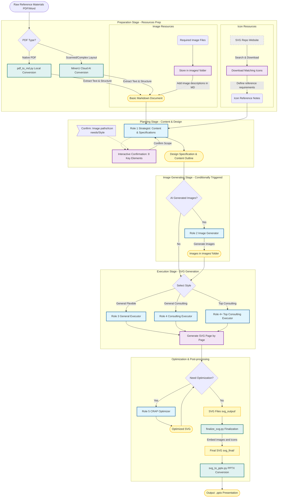

# PPT Master - AI-Powered Multi-Format SVG Content Generation System

[](./VERSION)
[](https://opensource.org/licenses/MIT)
[](https://github.com/hugohe3/ppt-master/stargazers)

English | [中文](./README.md)

An AI-powered intelligent visual content generation system that transforms source documents into high-quality SVG content through collaboration of multiple professional roles, **supporting presentations, social media, marketing posters, and various other formats**.

> 🎴 **Online Examples**: [GitHub Pages Online Preview](https://hugohe3.github.io/ppt-master/) - View actual generated results

> 🎬 **Quick Demo**: [YouTube](https://www.youtube.com/watch?v=jM2fHmvMwx0) | [Bilibili](https://www.bilibili.com/video/BV1iUmQBtEGH/) - Watch video demonstrations

---

## 🚀 Quick Start Guide

### Recommended Tools

| Tool | Rating | Description |
|------|:------:|------|
| **[Antigravity](https://antigravity.dev/)** | ⭐⭐⭐ | **Highly Recommended**! Free Opus 4.5 access, integrated Banana image generation, can generate images directly in the repository |
| [Cursor](https://cursor.sh/) | ⭐⭐ | Mainstream AI editor, supports multiple models |
| [VS Code + Copilot](https://code.visualstudio.com/) | ⭐⭐ | Microsoft official solution |
| [Claude Code](https://claude.ai/) | ⭐⭐ | Anthropic official CLI tool |

> 💡 **AI Image Generation Tip**: For AI-generated images, we recommend generating them in [Gemini](https://gemini.google.com/) and selecting **Download full size** for higher resolution than Antigravity's direct generation. Gemini images have a star watermark in the bottom right corner, which can be removed using [gemini-watermark-remover](https://github.com/journey-ad/gemini-watermark-remover) or this project's `tools/gemini_watermark_remover.py`.

### Three Steps to Start

```
1️⃣ Clone the Repository
   Open editor → Clone Repository → Enter this repository URL
   git clone https://github.com/hugohe3/ppt-master.git

2️⃣ Open Chat Window
   Open AI chat panel in your editor (Antigravity/Cursor/Copilot Chat)

3️⃣ Start Conversation
   Tell the AI what content you want to create, it will automatically follow the role definitions in the repository
```

### Usage Example

```
User: I have a Q3 quarterly report that needs to be made into a PPT

AI (Strategist role): Sure, before we begin I need to complete eight confirmations...
   1. Canvas format: [Recommended] PPT 16:9
   2. Page count: [Recommended] 8-10 pages
   ...
```

💡 **Model Recommendation**: Opus 4.5 works best, Antigravity currently offers free access

---

## 🎴 Featured Examples

> 📁 **Example Library**: [`examples/`](./examples/) · **15 projects** · **229 SVG pages**

### Example Projects Overview

| Category | Project | Pages | Features |
|------|------|:----:|------|
| 🏢 **Consulting Style** | [Attachment in Psychotherapy](./examples/ppt169_顶级咨询风_心理治疗中的依恋/) | 32 | Top consulting style, largest scale example |
| | [Building Effective AI Agents](./examples/ppt169_顶级咨询风_构建有效AI代理_Anthropic/) | 15 | Anthropic engineering blog, AI Agent architecture |
| | [Chongqing Regional Report](./examples/ppt169_顶级咨询风_重庆市区域报告_ppt169_20251213/) | 20 | Regional fiscal analysis, Enterprise Alert data 🆕 |
| | [Ganzi Prefecture Economic Analysis](./examples/ppt169_顶级咨询风_甘孜州经济财政分析/) | 17 | Government fiscal analysis, Tibetan cultural elements |
| | [Nam Ou River Hydropower Strategic Assessment](./examples/ppt169_高端咨询风_南欧江水电站战略评估/) | 20 | "Basin Crisis" design language |
| | [Automotive Certification 5-Year Strategic Plan](./examples/ppt169_高端咨询风_汽车认证五年战略规划/) | 20 | McKinsey/BCG style |
| | [McKinsey Style Customer Loyalty](./examples/ppt169_麦肯锡风_kimsoong_customer_loyalty/) | 8 | Classic McKinsey MECE principles |
| | [Google Annual Work Report](./examples/ppt169_谷歌风_google_annual_report/) | 10 | Google brand design language |
| 🎨 **General Flexible** | [Debug Six-Step Method](./examples/ppt169_通用灵活+代码_debug六步法/) | 10 | Dark tech style |
| | [Chongqing University Thesis Format](./examples/ppt169_通用灵活+学术_重庆大学论文格式标准/) | 11 | Academic standards guide |
| | [AI Programming Tools Comparison](./examples/ppt169_通过灵活+代码_三大AI编程神器横向对比/) | 11 | Tech review style |
| ✨ **Creative Style** | [I Ching Qian Hexagram Study](./examples/ppt169_易理风_地山谦卦深度研究/) | 20 | I Ching aesthetics, Yin-Yang design |
| | [Diamond Sutra Chapter 1 Study](./examples/ppt169_禅意风_金刚经第一品研究/) | 15 | Zen academic, ink wash whitespace |
| | [Git Introduction Guide](./examples/ppt169_像素风_git_introduction/) | 10 | Pixel retro game style |
| | [PPT Master Introduction](./examples/demo_project_intro_ppt169_20251211/) | 10 | Fresh tech style |

📖 [View Complete Examples Documentation](./examples/README.md)

### Featured Works

#### Top Consulting Style · Attachment in Psychotherapy (32 pages)

> Largest scale example project, "Secure Base" visual metaphor

📁 [View Project](./examples/ppt169_顶级咨询风_心理治疗中的依恋/) · 📄 [Design Specification](./examples/ppt169_顶级咨询风_心理治疗中的依恋/设计规范与内容大纲.md)

#### I Ching Style · Qian Hexagram Deep Study (20 pages)

> Yin-Yang transformation design language, six-line progressive structure

📁 [View Project](./examples/ppt169_易理风_地山谦卦深度研究/) · 📄 [Design Specification](./examples/ppt169_易理风_地山谦卦深度研究/设计规范与内容大纲.md)

#### Pixel Retro Style · Git Introduction Guide (10 pages)

> Neon color scheme, "Save Point" version control metaphor

📁 [View Project](./examples/ppt169_像素风_git_introduction/) · 📄 [Design Specification](./examples/ppt169_像素风_git_introduction/设计规范与内容大纲.md)

---

<details>
<summary><b>📋 Table of Contents (Click to expand)</b></summary>

| Section | Link |
|------|------|
| 🚀 Quick Start Guide | [Jump](#-quick-start-guide) |
| 🎴 Featured Examples | [Jump](#-featured-examples) |
| Project Introduction | [Jump](#project-introduction) |
| Core Features | [Jump](#core-features) |
| System Architecture | [Jump](#system-architecture) |
| Roles | [Jump](#roles) |
| Getting Started | [Jump](#getting-started) |
| More Examples | [Jump](#more-examples) |
| Design Styles | [Jump](#design-styles) |
| Technical Specifications | [Jump](#technical-specifications) |
| Project Structure | [Jump](#project-structure) |
| Best Practices | [Jump](#best-practices) |
| FAQ | [Jump](#faq) |
| Contributing Guide | [Jump](#contributing-guide) |
| Roadmap | [Jump](#roadmap) |
| 🛠️ Toolset | [Jump](#️-toolset) |
| 📄 License | [Jump](#-license) |
| 🙏 Acknowledgments | [Jump](#-acknowledgments) |
| 📮 Contact | [Jump](#-contact) |

</details>

## 📚 Documentation Navigation

- 🚀 **Getting Started**: Read this README
- 📖 **Detailed Tutorial**: [Workflow Tutorial](./docs/workflow_tutorial.md)
- 🎨 **Design Guide**: [Design Guidelines](./docs/design_guidelines.md)
- 📐 **Canvas Formats**: [All Supported Formats](./docs/canvas_formats.md)
- 🖼️ **Image Embedding**: [SVG Image Embedding Guide](./docs/svg_image_embedding.md)
- 📊 **Chart Templates**: [Standardized Chart Template Library](./templates/charts/) - 13 common charts · [Online Preview](./templates/charts/preview.html)
- ⚡ **Quick Reference**: [Quick Reference Guide](./docs/quick_reference.md)
- 🔧 **Role Definitions**: [View All Roles](./roles/README.md)
- 🛠️ **Toolset**: [Tools Usage Guide](./tools/README.md)
- 💼 **Examples Index**: [View All Examples](./examples/README.md)

## Project Introduction

PPT Master is an innovative AI-assisted visual content creation system that achieves a complete workflow from content planning to visual optimization through collaboration of multiple professional AI roles. The system not only supports generating business presentations that meet the standards of top consulting firms (such as McKinsey, Boston Consulting), but also supports various social media and marketing materials formats including Xiaohongshu posts, WeChat Moments posters, Instagram, and more.

## Core Features

✨ **Intelligent Content Deconstruction** - Automatically analyzes source documents and reorganizes them into clear page sequences
🎨 **Three Design Styles** - Supports "General Flexible", "General Consulting" and "Top Consulting (MBB Level)"
📐 **Multi-Format Support** - Presentations (16:9/4:3), Xiaohongshu (3:4), WeChat Moments (1:1), Story (9:16) and 10+ other formats
📊 **Data Visualization** - Built-in charts, timelines, KPI displays and other professional components
🎯 **CRAP Design Principles** - Follows four core principles: Contrast, Repetition, Alignment, Proximity
🖼️ **Pure SVG Output** - High-quality vector graphics, automatically adapts to different sizes, no third-party dependencies
🎤 **Speaker Notes** - Auto-generates scripts and embeds into PPTX, supports presenter view 🆕
🔄 **Iterative Optimization** - Supports page-by-page generation and feedback modification

## System Architecture

### Quick Overview

```
User Input (PDF/URL/Markdown)
    ↓
[Source Content Conversion] Auto-triggered
    ├─ PDF → pdf_to_md.py
    ├─ URL → web_to_md.py / web_to_md.cjs
    └─ MD  → Direct read
    ↓
[Strategist] - Eight Confirmations & Design Specifications
    │
    ├─ Image Method = "C) AI Generated"?
    │       │
    │       YES → [Image_Generator] - Generate images to images/
    │       │
    │       NO ──────────────────────────────────────────┐
    │                                                │
    ▼                                                ▼
[Executor_General / Executor_Consultant / Executor_Consultant_Top] - SVG Code Generation
    ↓
[Optimizer_CRAP] - Visual Optimization (Optional)
    ↓
SVG Files (svg_output/)
    ↓
Post-processing Tools (Auto-executed)
    ├── finalize_svg.py    → svg_final/ (Embed icons + Fix image aspect ratio + Embed images + Text flattening + Round corners to Path)
    └── svg_to_pptx.py     → output.pptx (Export to PowerPoint + Embed speaker notes)
```

> **Note**: Source content conversion is mandatory - tools must be called immediately upon detecting PDF/URL. Image_Generator is a sequential step, images must be collected before entering Executor phase.

### Complete Workflow Diagram



## Roles

> The system includes 6 professional roles: 1 Strategist + 1 Image Generator (conditionally triggered) + 3 Executor variants + 1 Optimizer

### 1️⃣ Strategist

**Responsibility**: Content analysis and design planning  
**Output**: Design Specification and Content Outline

⚠️ **Important**: The first step in the workflow is **Initial Communication and Scope Confirmation**

**Core Capabilities**:

- **Initial Communication (Eight Confirmations)**: Must complete the following confirmations before analyzing content, providing professional recommendations:
  1. 📐 **Canvas Format**: Recommend the most suitable format based on usage scenario (PPT/Xiaohongshu/WeChat Moments, etc.)
  2. 📊 **Page Count**: Suggest reasonable page range based on content volume and complexity
  3. 🎯 **Target Audience & Scenario**: Pre-judge target audience and usage scenario based on document characteristics
  4. 🎨 **Design Style**: A) General Flexible B) General Consulting C) Top Consulting (MBB Level), with recommendation rationale
  5. 🎨 **Color Scheme**: Provide specific HEX values for primary, secondary, and accent colors
  6. 🔣 **Icon Method**: A) Emoji B) AI Generated C) Built-in Icon Library D) Custom Path
  7. 🖼️ **Image Usage**: A) No images B) User provided C) AI Generated D) Placeholder reserved
  8. 📝 **Typography**: Font combination (P1-P5 preset or custom) + body font size baseline (14-20pt)
- **Intelligent Deconstruction**: Break down and reorganize source documents into clear page sequences
- **Color Scheme**: Propose complete color scheme (primary, secondary, base tones)
- **Layout Planning**: Plan page sequences and recommend layout solutions
- **Typography System**: Define font combinations and size hierarchy
- **Stylized Output**:
  - General Flexible Style: Focus on visual layout (canvas adaptation, color scheme, typography system)
  - General Consulting Style: Focus on structured presentation (MECE decomposition, KPI dashboards)
  - Top Consulting Style: Focus on professional expression (SCQA framework, Pyramid Principle, data contextualization)

📄 [View Complete Role Definition](./roles/Strategist.md)

### 2️⃣ Image_Generator (Image Generator) - Conditionally Triggered

**Responsibility**: AI image generation (conditionally triggered)  
**Output**: Image files + optimized prompts

**Trigger Condition**: Only called when user selects "C) AI Generated" for image method in Strategist's eight confirmations

**Workflow Position**: After Strategist, before Executor (sequential, not parallel)

**Core Capabilities**:

- Analyze "Image Resource List" from design specifications
- Generate optimized prompts for each image (also serves as image description/alt text)
- Generate images through AI tools (automatic or manual)
- Save images to project `images/` directory

**Input**: Design specifications (with Image Resource List)

**Output**:
- Optimized image prompts
- Generated image files
- Updated Image Resource List

📄 [View Complete Role Definition](./roles/Image_Generator.md)

### 3️⃣ Executor_General (General Executor)

**Responsibility**: Generate SVG code in general flexible style  
**Output**: Single page SVG code

**Core Capabilities**:

- **Absolute Specification Compliance**: Strictly follow the design specifications confirmed by Strategist
- **Page-by-Page Generation**: Generate only one page at a time to ensure quality and controllability
- **Dynamic Adjustment**: Intelligently fine-tune elements while following mandatory dimensions
- **Iterative Modification**: Support regeneration based on feedback
- **Technical Requirements**:
  - Canvas size: Auto-adapt based on selected format (PPT: 1280×720, Xiaohongshu: 1242×1660, etc.)
  - viewBox matches canvas size
  - `<foreignObject>` is strictly prohibited
  - Use `<tspan>` for manual line breaks
  - Adjust layout and card sizes based on canvas ratio

📄 [View Complete Role Definition](./roles/Executor_General.md)

### 4️⃣ Executor_Consultant (General Consulting Executor)

**Responsibility**: Generate SVG code in general consulting style  
**Output**: Business-level presentation pages

**Core Capabilities**:

- **Basic Consulting Style**: Clean, clear, data visualization
- **Data-Driven**: Use charts, timelines and other visualization tools
- **KPI Display**: Professional dashboards and key metrics presentation
- **Clear Structure**: Organize content into maximum 5 logical sections
- **Professional Colors**: Use consulting industry standard colors

📄 [View Complete Role Definition](./roles/Executor_Consultant.md)

### 5️⃣ Executor_Consultant_Top (Top Consulting Executor)

**Responsibility**: Generate SVG code in top consulting style (MBB Level)  
**Output**: Strategic-level presentation pages

**Core Capabilities**:

- **MBB Level Style**: Adopts design styles of top consulting firms like McKinsey, Bain, BCG
- **5 Core Techniques**:
  1. **Data Contextualization**: Never present data in isolation, always with comparison reference
  2. **SCQA Framework**: Situation → Complication → Question → Answer narrative structure
  3. **Pyramid Principle**: Conclusion first, evidence supports
  4. **Strategic Use of Color**: Focus attention, reduce cognitive load
  5. **Chart vs Table Selection**: Choose the best visualization form based on scenario
- **Professional Colors**: Use McKinsey blue, BCG dark blue and other top consulting colors
- **Reasonable Layout**: Ensure elements don't overlap, ample white space

📄 [View Complete Role Definition](./roles/Executor_Consultant_Top.md)

### 6️⃣ Optimizer_CRAP (CRAP Optimizer)

**Responsibility**: Optimize design based on CRAP principles  
**Output**: Optimized SVG code (yh\_ prefix)

**Four Core Principles**:

1. **Alignment**:

   - Check and correct element alignment relationships
   - Create powerful invisible visual connection lines
   - Ensure every element has clear alignment relationship with others

2. **Contrast**:

   - Enhance visual hierarchy, highlight key information
   - Increase size, font weight or color differences
   - Create clear visual focus

3. **Repetition**:

   - Unify visual style of similar elements
   - Repeatedly use colors, fonts, rounded corners and other visual elements
   - Create organization and unity

4. **Proximity**:
   - Group related content spatially close together
   - Increase distance between different logical blocks
   - Form clear visual units

📄 [View Complete Role Definition](./roles/Optimizer_CRAP.md)

## Getting Started

### Basic Workflow

1. **Prepare Source Document**  
   
   Convert raw reference materials to AI-readable format:
   
   | Step | Description |
   |------|------|
   | 📄 **Document Conversion** | **Prefer** `python3 tools/pdf_to_md.py <PDF_file>` for local conversion (fast, free, privacy-safe). For scanned PDFs, complex multi-column layouts, or math formulas, use [MinerU](https://github.com/opendatalab/MinerU) cloud AI conversion |
   | 🖼️ **Image Resources** | Store required images in the project's `images/` folder and add image descriptions in the Markdown |
   | 🔣 **Icon Resources** | For custom icons, download from [SVG Repo](https://www.svgrepo.com/), or use the built-in 640+ icon library (`templates/icons/`) |
   
   > 💡 **PDF Conversion Strategy**: PyMuPDF first (local, instant), MinerU as fallback (cloud AI). See [Tools Usage Guide](./tools/README.md)

2. **Initial Communication (Eight Confirmations)**
   Conduct scope confirmation with Strategist, who will provide professional recommendations on these eight items:

   1. **Canvas Format**: PPT/Xiaohongshu/WeChat Moments/Story, etc. (recommend based on usage scenario)
   2. **Page Count**: Suggest reasonable page count based on content volume analysis
   3. **Target Audience & Scenario**: Pre-judge based on document characteristics
   4. **Design Style**: A) General Flexible B) General Consulting C) Top Consulting (MBB Level)
   5. **Color Scheme**: Primary, secondary, accent colors (provide specific HEX values)
   6. **Icon Method**: A) Emoji B) AI Generated C) Built-in Icon Library D) Custom Path
   7. **Image Usage**: A) No images B) User provided C) AI Generated D) Placeholder reserved
   8. **Typography**: Font combination (P1-P5 preset) + body font size baseline (14-20pt)

   💡 Strategist will not only ask questions but also proactively provide professional recommendations for your reference or confirmation

3. **Get Planning**  
   Strategist analyzes content and generates Design Specification and Content Outline, with different focuses based on selected style:
   - General Flexible: Visual layout specifications (canvas adaptation, typography system)
   - General Consulting: Structured layout (MECE decomposition, data visualization)
   - Top Consulting: Professional expression methodology (SCQA, Pyramid Principle, 5 core techniques)

4. **Page-by-Page Generation**
   Use the corresponding Executor role to generate each SVG page

5. **Optimization Polish** (Optional)
   Use Optimizer_CRAP for CRAP principle optimization

6. **Post-processing** (Recommended)
   ```bash
   python3 tools/finalize_svg.py <project_path>     # Execute all post-processing
   ```

7. **Export for Use**
   ```bash
   # Export to PPTX
   python3 tools/svg_to_pptx.py <project_path> -s final      # Use svg_final (recommended)
   python3 tools/svg_to_pptx.py <project_path>               # Use svg_output (original version)
   ```
   Or embed SVG files directly into other presentation environments

### Example Dialogue Flow

```
User: I have a market analysis report that needs to be made into a presentation

Strategist: Before I start analyzing your content, I need to complete eight confirmations:

1. Canvas Format: [Recommended] PPT 16:9 (1280×720), suitable for business presentation scenarios

2. Page Count: [Recommended] 8-10 pages, ensure each core topic has sufficient display space

3. Target Audience & Scenario: [Recommended] Strategic analysis material for corporate middle and senior management,
   suitable for quarterly/annual strategic meetings

4. Design Style: [Recommended] C) Top Consulting Style (MBB Level),
   reflects data-driven and professional authority

5. Color Scheme: [Recommended]
   - Primary: #005587 (McKinsey Blue) - Professional, trustworthy
   - Secondary: #E8E8E8 (Light Gray) - Background, white space
   - Accent: #FF6B35 (Vibrant Orange) - Data highlights, emphasis

6. Icon Method: [Recommended] C) Built-in Icon Library, professional and clean

7. Image Usage: [Recommended] A) No images, data reports focus on charts

8. Typography: [Recommended] P1 preset (Microsoft YaHei + Arial), body 18pt baseline

User: I agree with your recommendations

Strategist: [Analyzes content, generates complete design specification and content outline...]

User: Great planning! Please generate page 1: Cover

Executor_Consultant_Top: [Generates page 1 SVG code...]

User: Please continue to generate page 2

Executor_Consultant_Top: [Generates page 2 SVG code...]

User: Page 2 is important, please optimize visual effects using CRAP principles

Optimizer_CRAP:
I will analyze page 2 and apply CRAP principles:
1. Alignment: Ensure all elements strictly align to grid
2. Contrast: Increase size difference between numbers and labels
3. Repetition: Unify card styles
4. Proximity: Group related data more closely
[Outputs optimized yh_slide_02.svg...]
```

💡 **Tip**: Check the example projects in the `examples/` directory to understand the complete project implementation process and final results.

## Design Styles

### General Flexible Style

- Use Cases: General business presentations, education training, team reports
- Design Features: Flexible layout, rich colors, easy to customize
- Content Structure: Clear logical hierarchy and visual guidance

### General Consulting Style

- Use Cases: Business reports, project reports, client presentations
- Design Features: Clean and clear, data visualization, professional feel
- Typical Elements: KPI dashboards, data charts, MECE decomposition

### Top Consulting Style (MBB Level)

- Use Cases: Strategic reports, board presentations, high-end client proposals
- Design Features: Clean and professional, data-driven, emphasizes insights
- Reference Standards: McKinsey, Bain, BCG and other top consulting firms
- **5 Core Techniques**: Data contextualization, SCQA framework, Pyramid Principle, strategic use of color, chart vs table selection
- Typical Elements: Matrix diagrams, timelines, KPI dashboards, waterfall charts, driver trees

## Technical Specifications

### SVG Parameters

- **Canvas Size**: Auto-adapts based on selected format (see [Canvas Format Specifications](./docs/canvas_formats.md))
  - PPT 16:9: 1280×720
  - PPT 4:3: 1024×768
  - Xiaohongshu: 1242×1660
  - WeChat Moments: 1080×1080
  - Story: 1080×1920
  - More formats...
- **ViewBox**: Matches canvas size
- **Background**: Defined using `<rect>` element
- **Text**: `<foreignObject>` disabled, use `<tspan>` for manual line breaks
- **Fonts**: Use the font scheme specified in the Design Specification (see [Font Selection](./docs/design_guidelines.md#font-selection))

### PPT Compatibility Rules (Must Follow)

To ensure consistent results after PPT export, transparency must use standard notation:

| ❌ Prohibited | ✅ Correct |
|--------|--------|
| `fill="rgba(255,255,255,0.1)"` | `fill="#FFFFFF" fill-opacity="0.1"` |
| `<g opacity="0.2">...</g>` | Set transparency individually for each child element |
| `<image opacity="0.3"/>` | Add mask layer after image `<rect fill="background-color" opacity="0.7"/>` |

> 📌 **Remember**: PPT doesn't recognize rgba, group opacity, or image opacity

### Layout Specifications

#### General Flexible Style

- **Margins**: Auto-adjust based on canvas ratio (landscape 40-60px, portrait 60-120px)
- **Card Size**: Dynamically calculated based on canvas height and layout method
- **Spacing**: 20-60px (adjust based on canvas size)

#### High-End Consulting Style

- Follow consulting industry best practices
- Emphasize white space and visual breathing room
- Data charts occupy main visual area
- Auto-adapt to different canvas ratios

### Color Schemes

#### Consulting Style Primary Colors

- Deloitte Blue: `#0076A8`
- McKinsey Blue: `#005587`
- BCG Dark Blue: `#003F6C`

#### General Color Principles

- Provide primary, secondary and base tones
- Support light/dark themes
- Use HEX color values

## Project Structure

```
ppt-master/
├── README.md                   # Project documentation
├── LICENSE                     # License file
├── .gitignore                 # Git ignore rules
│
├── roles/                     # AI role definitions (Do not test/write examples in this directory)
│   ├── README.md              # Role overview and workflow
│   ├── Strategist.md          # Strategist role definition
│   ├── Image_Generator.md     # Image Generator role definition (conditionally triggered)
│   ├── Executor_General.md    # General Executor role definition
│   ├── Executor_Consultant.md # General Consulting Executor role definition
│   ├── Executor_Consultant_Top.md # Top Consulting Executor role definition (MBB Level)
│   └── Optimizer_CRAP.md      # CRAP Optimizer role definition
│
├── examples/                  # Examples folder (each example in separate directory)
│   └── <project_name>_<format>_<YYYYMMDD>/
│       ├── README.md
│       ├── 设计规范与内容大纲.md / design_specification.md
│       ├── preview.html (optional)
│       └── svg_output/
│
├── docs/                      # Documentation center
│   ├── canvas_formats.md      # Canvas format specifications
│   ├── design_guidelines.md   # Detailed design guide (colors, typography, layout)
│   ├── svg_image_embedding.md # SVG image embedding guide
│   ├── workflow_tutorial.md   # Workflow tutorial (practical case demonstration)
│   └── quick_reference.md     # Quick reference guide (cheat sheet)
│
├── templates/                 # Standardized template library
│   ├── charts/                # Chart templates (13 types: KPI, bar, line, etc.)
│   │   ├── README.md          # Chart template usage instructions
│   │   ├── preview.html       # Online preview all templates
│   │   └── *.svg              # 13 chart template files
│   └── icons/                 # Icon library (640+ vector icons)
│       └── README.md          # Icon library usage instructions
│
├── tools/                     # Utility tools
│   ├── README.md              # Tools documentation
│   ├── project_manager.py     # Project management tool
│   ├── svg_quality_checker.py # SVG quality check
│   ├── batch_validate.py      # Batch validation tool
│   ├── finalize_svg.py        # Finalization processing (embed icons + fix image aspect + embed images)
│   ├── embed_icons.py         # Icon embedding tool
│   ├── embed_images.py        # Image embedding tool
│   ├── fix_image_aspect.py    # Image aspect ratio fix tool (prevent stretching in PPT)
│   ├── flatten_tspan.py       # tspan flattening tool
│   └── svg_to_pptx.py         # SVG to PPTX tool (native vector embedding)
│
└── projects/                  # User project workspace (work in progress)
    └── <your_project_name>_<YYYYMMDD>/

**Important**: All project folders must end with date suffix, format `_YYYYMMDD` (e.g.: `_20251012`)

```

## Best Practices

### Content Preparation

1. **Clear Logical Structure** - Ensure source document has clear sections and key points
2. **Sufficient Data Preparation** - Provide specific numbers and data support
3. **Visual Element Suggestions** - Pre-consider chart types and layout needs

### Design Process

1. **Thorough Communication** - Confirm all design parameters with Strategist
   - 💡 Strategist will proactively provide professional recommendations, consider these suggestions carefully
   - 📋 If you have different ideas, discuss and adjust with Strategist's recommendations
2. **Page-by-Page Verification** - Check results after generating each page
3. **Timely Optimization** - Use Optimizer_CRAP to improve quality of key pages
4. **Maintain Consistency** - Ensure unified style across the entire slide deck

### Output Management

1. **File Naming** - Use clear naming rules (e.g.: `01_cover.svg`)
2. **Version Control** - Save versions of each iteration
3. **Format Conversion** - Convert to PNG or PDF as needed
4. **Project Organization** - Place each presentation project in `projects/` directory, including design specifications and SVG output

## More Examples

This repository is an **AI workflow framework**, providing complete role definitions, templates and toolsets.

### 📂 Project Structure

Example projects should be located in the `examples/` directory, using the following structure:

```
examples/
└── <project_name>_<format>_<YYYYMMDD>/
    ├── 设计规范与内容大纲.md
    ├── images/              # Image resources
    ├── svg_output/          # Original SVG (with placeholders)
    └── svg_final/           # Final SVG (icons/images embedded)
```

### 🔍 Preview SVG

```bash
# Preview with local server
python3 -m http.server --directory examples/<project>/svg_final 8000
# Then visit http://localhost:8000
```

### 🚀 Start Your Project

#### Using Project Management Tool (Recommended)

```bash
# 1. Initialize new project
python3 tools/project_manager.py init my_project --format ppt169

# 2. Edit generated design specification file
# projects/my_project_ppt169_20251116/设计规范与内容大纲.md

# 3. Use AI roles to generate SVG files to svg_output/ directory

# 4. Validate project structure
python3 tools/project_manager.py validate projects/my_project_ppt169_20251116
```

#### Manual Project Creation

Reference the example structure, create your own project in the `projects/` directory:

```
projects/
└── your_project_name_format_YYYYMMDD/    # Must add format and date suffix
    ├── README.md                         # Project description
    ├── 设计规范与内容大纲.md              # Design specification generated by Strategist
    ├── 来源文档.md                        # Source document (optional)
    ├── preview.html                      # Preview page (auto-generated)
    └── svg_output/                       # Generated SVG files
        ├── 01_cover.svg
        ├── 02_xxx.svg
        └── ...
```

**Important Naming Rules**:
- Project folder name format: `{project_name}_{format}_{YYYYMMDD}`
- format: `ppt169`, `ppt43`, `wechat`, `xiaohongshu`, `story`, etc.
- Date uses 8-digit format, e.g., `20251116` for November 16, 2025
- Example: `my_presentation_ppt169_20251116`

For detailed naming conventions, please refer to the examples above

## FAQ

<details>
<summary><b>Q: How to use the generated SVG files?</b></summary>

A: SVG files can be:

- Opened directly in browser to view
- Embedded into HTML pages
- Edited with design tools (e.g., Figma, Adobe Illustrator)
- Converted to PNG/PDF format for traditional presentation software

</details>

<details>
<summary><b>Q: What's the difference between the executors?</b></summary>

A:

- **Executor_General**: For general scenarios, provides flexible layout and rich visual choices
- **Executor_Consultant**: For general consulting scenarios, clean and clear data visualization
- **Executor_Consultant_Top**: For top consulting scenarios (MBB Level), uses 5 core expression techniques

</details>

<details>
<summary><b>Q: When is Image_Generator used?</b></summary>

A: Image_Generator is only triggered when you select "C) AI Generated" for the image method during Strategist's eight confirmations. It generates optimized prompts and images before the Executor phase, so Executor can directly reference the generated images.

</details>

<details>
<summary><b>Q: Is Optimizer_CRAP required?</b></summary>

A: No, it's not required. If the SVG generated by Executor already meets your needs, you can skip the optimization step. Optimizer is mainly used to further enhance the visual quality of key pages.

</details>

<details>
<summary><b>Q: Can I customize the color scheme?</b></summary>

A: Yes! When communicating with Strategist, clearly state your brand colors or preferred color scheme, and Strategist will adjust the design specification accordingly.

</details>

## Contributing Guide

We welcome contributions of all kinds!

### How to Contribute

1. Fork this repository
2. Create feature branch (`git checkout -b feature/AmazingFeature`)
3. Commit changes (`git commit -m 'Add some AmazingFeature'`)
4. Push to branch (`git push origin feature/AmazingFeature`)
5. Open Pull Request

### Contribution Areas

- 🎨 Add new design style templates
- 📊 Expand chart types and visualization components
- 📝 Improve documentation and tutorials
- 🐛 Report bugs and issues
- 💡 Suggest new features
- 🌍 Multi-language support
- 📁 Share your project cases to `examples/` directory

## Roadmap

### ✅ Completed

- [x] Established complete role system and workflow
- [x] Implemented general and consulting design styles
- [x] Multi-format canvas support (PPT 16:9/4:3, Xiaohongshu, WeChat Moments, Story and 10+ formats)
- [x] Project management toolset (initialization, validation, quality check, batch processing)
- [x] Standardized chart template library (33 chart types)
- [x] 640+ vector icon library (sourced from SVG Repo)
- [x] Strategist proactive recommendation feature (upgraded from passive questioning to proactive advisor)
- [x] **Example project library** (15 projects, 229 SVG pages, covering consulting/general/creative styles)
- [x] Online example showcase ([Slides Gallery](https://notes.36sjs.com/pages/ppt/slides-library.html))

### 📋 Planned

- [ ] Develop interactive configuration tool
- [ ] Support animations and interactivity
- [ ] Web interface development
- [ ] API interface design
- [ ] GitHub Actions CI/CD integration

## 🛠️ Toolset

PPT Master provides a complete set of tools to simplify project management and content generation workflows.

### Project Management Tool (`project_manager.py`)

One-stop tool for creating, validating and managing projects:

```bash
# Initialize new project
python3 tools/project_manager.py init <project_name> --format ppt169

# Validate project structure
python3 tools/project_manager.py validate <project_path>

# View project information
python3 tools/project_manager.py info <project_path>
```

Supported canvas formats: `ppt169`, `ppt43`, `wechat`, `xiaohongshu`, `moments`, `story`, `banner`, `a4`

### SVG Quality Check Tool (`svg_quality_checker.py`)

Check if SVG files comply with project technical specifications:

```bash
# Check single file or directory
python3 tools/svg_quality_checker.py examples/project/svg_output

# Check all projects
python3 tools/svg_quality_checker.py --all examples

# Specify expected format
python3 tools/svg_quality_checker.py examples/project --format ppt169
```

**Check Items**: viewBox attribute, prohibited elements (foreignObject), font usage, width/height consistency, text wrapping method, file size

### Batch Validation Tool (`batch_validate.py`)

Check structural integrity of multiple projects at once:

```bash
# Validate single directory
python3 tools/batch_validate.py examples

# Validate all projects
python3 tools/batch_validate.py --all

# Export report
python3 tools/batch_validate.py examples --export
```

### Examples Index Generator (`generate_examples_index.py`)

Automatically scan examples directory and generate README.md index file:

```bash
python3 tools/generate_examples_index.py
```

### Post-processing Tool (`finalize_svg.py`)

Unified post-processing entry, performs icon embedding, image aspect ratio fixing, image embedding, text flattening, round corners to Path:

```bash
# Run directly, no parameters needed
python3 tools/finalize_svg.py <project_path>
```

**Processing Steps**:
1. Embed icons - Replace `<use data-icon="..."/>` with actual icons
2. Fix image aspect ratio - Prevent image stretching when converting to shapes in PPT ✨
3. Embed images - Convert external images to Base64
4. Text flattening - Convert `<tspan>` to independent `<text>`
5. Round corners to Path - Convert `<rect rx="..."/>` to `<path>`

**Note**: Generation phase should still use `<tspan>` for manual line breaks, post-processing will auto-flatten.

### SVG to PPTX Tool (`svg_to_pptx.py`)

Batch convert SVG files to PowerPoint presentations (native SVG vector embedding):

```bash
# Use final version (recommended)
python3 tools/svg_to_pptx.py <project_path> -s final

# Use original version
python3 tools/svg_to_pptx.py <project_path>

# Specify output file
python3 tools/svg_to_pptx.py <project_path> -s final -o output.pptx
```

**Features**: SVG embedded as native vector format, maintains editability, requires PowerPoint 2016+ to view.

### Error Message Helper (`error_helper.py`)

Provides friendly error messages and specific fix suggestions:

```bash
# View all error types
python3 tools/error_helper.py

# View solution for specific error
python3 tools/error_helper.py missing_readme
```

---

📖 **Detailed Documentation**: [Tools Usage Guide](./tools/README.md)

## 📄 License

This project is licensed under the [MIT License](LICENSE).

You are free to:

- ✅ Commercial use
- ✅ Modify source code
- ✅ Distribute and sublicense
- ✅ Private use

But you must:

- 📋 Retain copyright notice
- 📋 Retain license notice

## 🙏 Acknowledgments

Thanks to the following open source projects:

- [SVG Repo](https://www.svgrepo.com/) - Beautiful open source icon library (640+ icons included in this project)
- [Robin Williams](https://en.wikipedia.org/wiki/Robin_Williams_(author)) - Creator of CRAP design principles
- McKinsey, Boston Consulting, Bain and other top consulting firms - Design inspiration sources

## 📮 Contact

- **Issue**: [GitHub Issues](https://github.com/hugohe3/ppt-master/issues)
- **GitHub**: [@hugohe3](https://github.com/hugohe3)
- **Project Link**: [https://github.com/hugohe3/ppt-master](https://github.com/hugohe3/ppt-master)

## 🌟 Star History

If this project helps you, please give it a ⭐ Star!

<a href="https://star-history.com/#hugohe3/ppt-master&Date">
 <picture>
   <source media="(prefers-color-scheme: dark)" srcset="https://api.star-history.com/svg?repos=hugohe3/ppt-master&type=Date&theme=dark" />
   <source media="(prefers-color-scheme: light)" srcset="https://api.star-history.com/svg?repos=hugohe3/ppt-master&type=Date" />
   
 </picture>
</a>

---

Made with ❤️ by Hugo He

[⬆ Back to Top](#ppt-master---ai-powered-multi-format-svg-content-generation-system)
